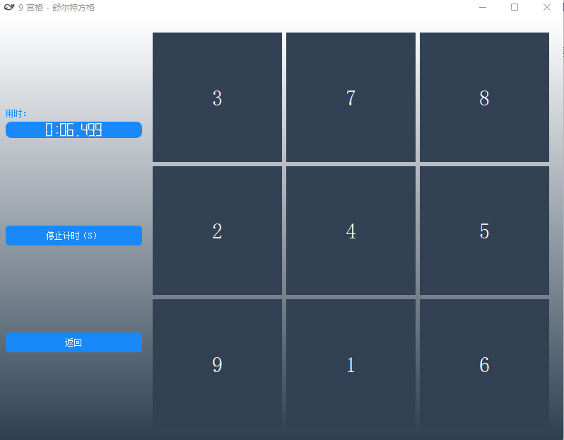

# SchulteGrid

## 背景

信息洪流时代，在手机的侵蚀下，大部分精力被碎片化，以至于难以专注，时常出现专注几分钟之后便分心的情况，故研发了此软件，旨在提升专注力。

## 原理介绍

舒尔特方格(Schulte Grid) 注意力测试训练

舒尔特方格的训练目标，包括以下几种能力：

+ 思维反应速度
+ 注意力
+ 视觉识别

舒尔特方格是全世界范围内最简单，最有效也是最科学的注意力训练方法。寻找目标数字时，注意力是需要极度集中的，把这短暂的高强度的集中精力过程反复练习，大脑的集中注意力功能就会不断的加固，提高。注意水平越来越高。

训练时，要求被测者用手指按 1 ~ 25 的顺序依次指出其位置，同时诵读出声，施测者一旁记录所用时间。数完 25 个数字所用时间越短，注意力水平越高。

## 功能

实现了多种宫格模式，可自行增加难度，同时会记录数据，可供查阅。

